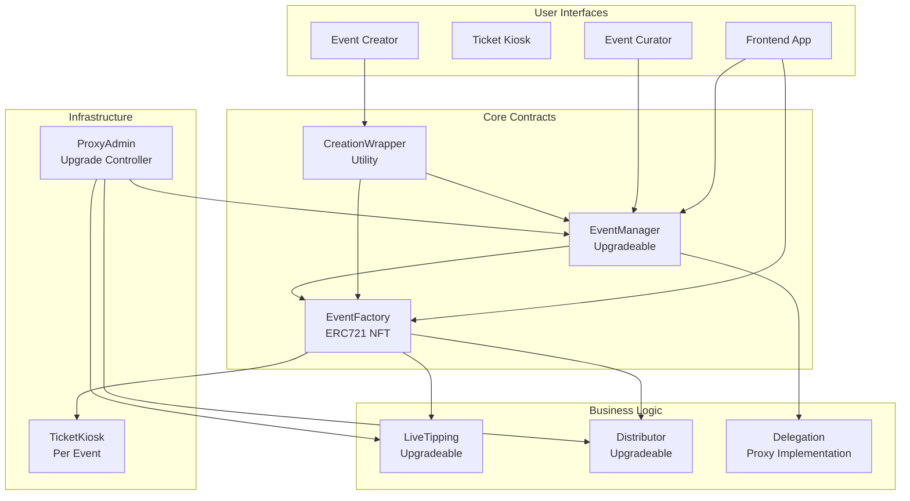
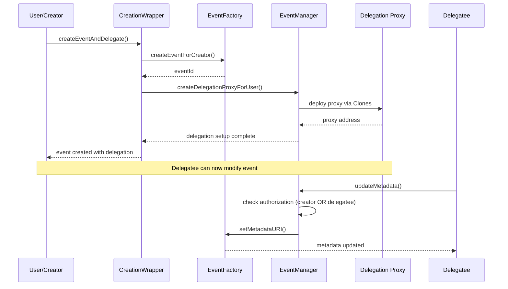
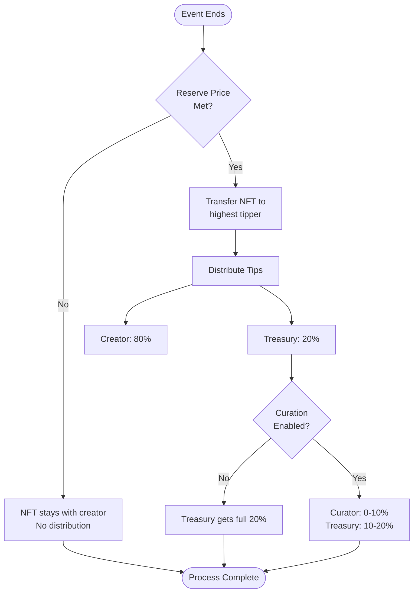
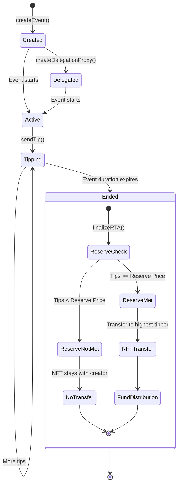

# Real-Time Asset (RTA) Protocol Suite

The RTA standard introduces a new asset class where the Real-Time Asset (dynamic streaming NFT) allows the creation, curation, live-tipping, and Video NFT ownership transfer for live events that acquire value in real-time, in the making. At the time of writing (08/06/25) the RTA standard is exclusive to the SEI network.

## Architecture Overview

The RTA platform consists of six core smart contracts that work together to enable decentralized event management with delegation patterns, real-time tipping, and automated fund distribution.

### Core Components



## Contract Descriptions

### 1. EventFactory (Non-upgradeable)
**Location**: `src/EventFactory.sol`

The central registry and ERC721 NFT contract. Each event is an NFT that can be transferred.

**Key Features**:
- ERC721 NFT minting for events
- Event metadata storage (URI, category, reserve price, duration)
- TicketKiosk deployment per event using CREATE2
- Integration with LiveTipping and Distributor contracts
- Finalization logic with reserve price validation and NFT transfer

**Core Functions**:
- `createEvent()` - Create new RTA NFT event
- `createEventForCreator()` - Create event on behalf of another address
- `setMetadataURI()` - Update event metadata (EventManager only)
- `setReservePrice()` - Update reserve price (EventManager only)
- `finalizeAndTransfer()` - Finalize event and transfer NFT to highest tipper

### 2. EventManager (Upgradeable)
**Location**: `src/EventManager.sol`

Manages post-creation operations and delegation patterns.

**Key Features**:
- Delegation proxy creation using OpenZeppelin Clones
- Permission management for metadata updates
- Event finalization orchestration
- Creator and delegatee authorization

**Core Functions**:
- `createDelegationProxy()` - Deploy delegation proxy for event
- `updateMetadata()` - Update event metadata with authorization checks
- `updateReservePrice()` - Update reserve price with validation
- `finalizeRTA()` - Trigger event finalization process
- `updateDelegate()` - Change delegated address for event

### 3. LiveTipping (Upgradeable)
**Location**: `src/LiveTipping.sol`

Handles real-time tipping during events with automatic highest tipper tracking.

**Key Features**:
- Real-time tip collection with message support
- Automatic highest tipper determination
- Event timing validation (start/end dates)
- Tip aggregation and history tracking

**Core Functions**:
- `sendTip()` - Send tip with message during event
- `getTotalTips()` - Get total tips for event
- `getHighestTipper()` - Get address of highest tipper
- `finalizeEvent()` - Mark event as finalized (creator only)

### 4. Distributor (Upgradeable)
**Location**: `src/Distributor.sol`

Manages fund distribution with configurable curation fees.

**Key Features**:
- 80% creator / 20% treasury base distribution
- Configurable curation fees (0-10% from treasury portion)
- Three curation scopes: Scope 1 (<3%), Scope 2 (3-6%), Scope 3 (6%+)
- Whitelisted curator system

**Core Functions**:
- `distributeTips()` - Distribute funds according to configuration
- `enableCuration()` - Enable curation for event (whitelisted curator only)
- `whitelistCurator()` - Add curator to whitelist (owner only)

### 5. Delegation (Proxy Implementation)
**Location**: `src/Delegation.sol`

Minimal proxy implementation for delegation records.

**Key Features**:
- Immutable delegation relationship storage
- Gas-efficient proxy pattern
- Event-specific delegation tracking

### 6. CreationWrapper (Utility)
**Location**: `src/CreationWrapper.sol`

Utility contract for atomic event creation with delegation setup.

**Key Features**:
- Single transaction event creation + delegation
- Improved user experience
- Gas optimization for common workflow

## Delegation Patterns

### Authorization Flow



### Metadata Modification Rights

The following metadata fields can be modified through the delegation system:

1. **Metadata URI** (`metadataURI`) - Complete event description, images, details
2. **Reserve Price** (`reservePrice`) - Minimum tip amount required for NFT transfer

**Restrictions**:
- Only before event starts (for reserve price)
- Only before finalization (for metadata)
- Only by creator or authorized delegatee

## Fund Distribution Logic

### Distribution Flow



### Curation Scopes

| Scope | Fee Range | Services |
|-------|-----------|----------|
| **Scope 1** | < 3% | Basic curation (description, schedule, banner) |
| **Scope 2** | 3-6% | Advanced curation (promotion, social media) |
| **Scope 3** | 6%+ | Premium curation (video enhancement, highlights) |

## Event Lifecycle



## Key Features Validated by Tests

Our comprehensive test suite (26 passing tests) validates:

### Delegation Patterns
- ✅ Event creation through EventFactory
- ✅ Event creation with immediate delegation via CreationWrapper
- ✅ Metadata updates by creator and delegatee
- ✅ Reserve price updates with proper authorization
- ✅ Multiple delegation proxies with isolated permissions
- ✅ Delegate updates by creator

### Finalization Logic
- ✅ Successful finalization when reserve price is met
- ✅ Finalization failure when reserve price not met
- ✅ NFT transfer to highest tipper
- ✅ Multiple tippers with highest determination
- ✅ Highest tipper changes during event
- ✅ Delegatee can finalize events
- ✅ Cannot finalize twice

### Fund Distribution
- ✅ 80% creator / 20% treasury distribution
- ✅ Fund distribution with curation fees
- ✅ Proper curation scope validation

### Security & Access Control
- ✅ Unauthorized users cannot modify events
- ✅ Cannot modify after event finalization
- ✅ Proper authorization checks for all functions

## Deployment

### Latest Deployment (SEI Testnet)

| Contract | Address |
|----------|---------|
| **ProxyAdmin** | `0x47F69FE41D603725957574601055A4df073F100B` |
| **EventFactory** | `0xF35E01BB322A208c89fFA19E0c155E5BcD65FC7E` |
| **EventManager** | `0xFFbBeb29D255966971d70129AE69001B87C9C801` |
| **LiveTipping** | `0xc9102Fa228F06c5b21FC45f8cA69bbF8caD7FdfA` |
| **Distributor** | `0x79CCF12832E201A287C9B59E1aa4d1BC65eA134c` |
| **Delegation Impl** | `0x8C48bac873177Fe542c22625C1dc6ecF9dC771B9` |
| **CreationWrapper** | `0x5d4da6D3e03cD5c1d61A0F9E0E93Ed7D40917CA9` |

### Deploy Script

```bash
forge script script/Haus.s.sol --rpc-url $SEI_TESTNET_RPC --broadcast
```

## Core Interaction Patterns

### For Event Creators

```solidity
// 1. Create event with delegation in one transaction
creationWrapper.createEventAndDelegate(
    startDate,
    duration,
    reservePrice,
    metadataURI,
    category,
    ticketsAmount,
    ticketPrice,
    delegateeAddress
);

// 2. Update metadata (creator or delegatee)
eventManager.updateMetadata(eventId, newMetadataURI);

// 3. Finalize event after it ends
eventManager.finalizeRTA(eventId);
```

### For Tippers

```solidity
// Send tip during event
liveTipping.sendTip{value: tipAmount}(eventId, "Great performance!");

// Check highest tipper
address highest = liveTipping.getHighestTipper(eventId);
uint256 total = liveTipping.getTotalTips(eventId);
```

### For Fund Distribution

```solidity
// Distribute collected tips
distributor.distributeTips{value: totalTipAmount}(eventId);

// Enable curation (whitelisted curator only)
distributor.enableCuration(eventId, 300, CurationScope.SCOPE_2); // 3%
```

## Security Considerations

1. **Access Control**: All metadata modifications require creator or delegatee authorization
2. **Timing Constraints**: Reserve price cannot be modified after event starts
3. **Finalization Safety**: Events can only be finalized once and only after proper validation
4. **Fund Security**: All fund transfers use secure patterns with reentrancy protection
5. **Upgrade Safety**: Upgradeable contracts use UUPS pattern with proper authorization

## Gas Optimization

- Uses OpenZeppelin Clones for delegation proxies (minimal proxy pattern)
- CREATE2 for deterministic TicketKiosk addresses
- Efficient storage patterns and custom errors
- Batch operations where possible
